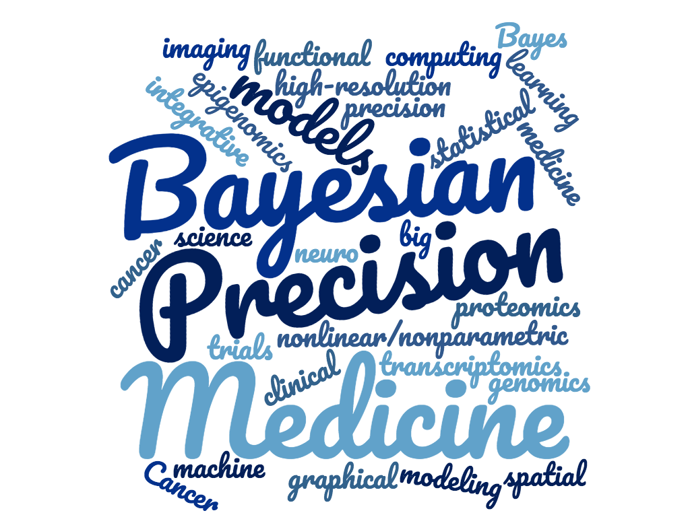

---
---

<style>
h1 {
  font-size: 48px; /* increase the font size */
  margin-top: 50px; /* move the title up */
}

.centered {
  text-align: center;
}
</style>

<br>

<div class="centered"><h1>BayesRx Group</h1></div>

<br>

```{r out.width = "70%", fig.align = "center", echo = FALSE}

```

We are a group of biostatisticians and data scientists, working at the intersection of statistics, biology and medicine. Our research explores the potential of Bayesian probabilistic models and machine learning methods to assist in medical and health sciences. These methods are motivated by large and complex datasets such as high-throughput genomics, epigenomics, transcriptomics and proteomics as well as high-resolution neuro- and cancer- imaging. A special focus is on developing integrative models combining different sources of data for biomarker discovery and clinical prediction to aid precision/translational medicine.
