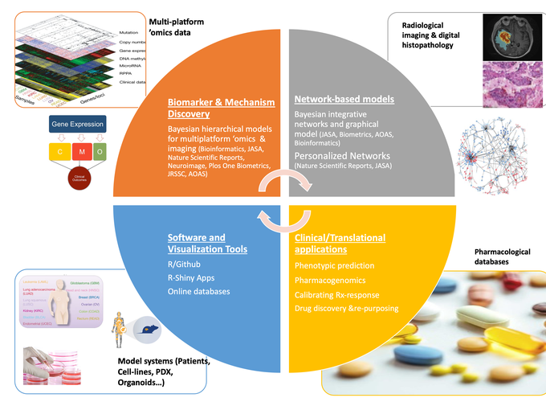

---

---

<br>

## BayesRx Group Current & Future Research Efforts

```{r out.width = "50%", fig.align = "center", echo = FALSE}

```

<br>

Our current and future research efforts have four main themes shown as four quadrants above. The first is developing Bayesian hierarchical models for multi-platform genomics and imaging data for mechanims and biomarker discovery (top left); Bayesian high-dimensional graphical/netwrok models (top right); development of scalable software for reproducibilty and visualization (bottom left – also see software section) and finally implement these tools in a clinical/translational setting (bottom right). The data sets that feed into these efforts are shown in the corners [see some selected publications below]

