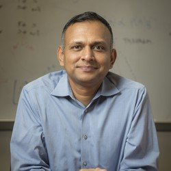

# Postdoctoral Researchers

    
    <h4>John Doe</h4>
    
<em>Research areas:</em> Bayesian inference, computational statistics

    
    <h4>Jane Doe</h4>
    
<em>Research areas:</em> Machine learning, data science

# PhD Students

    
    <h4>James Smith</h4>
    
<em>Research areas:</em> Bayesian networks, probabilistic graphical models

    
    <h4>Sarah Johnson</h4>
    
<em>Research areas:</em> Deep learning, computer vision

    
    <h4>Michael Brown</h4>
    
<em>Research areas:</em> High-dimensional statistics, sparse regression

# Masters Students

    
    <h4>Alice Lee</h4>
    
<em>Research areas:</em> Bayesian optimization, experimental design

    

    
    <h4>Emily Kim</h4>
    
<em>Research areas:</em> Statistical genetics, bioinformatics

